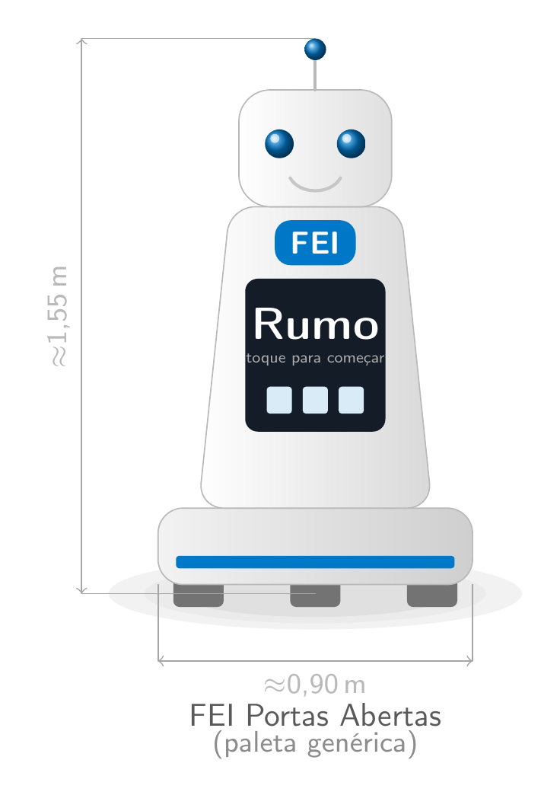
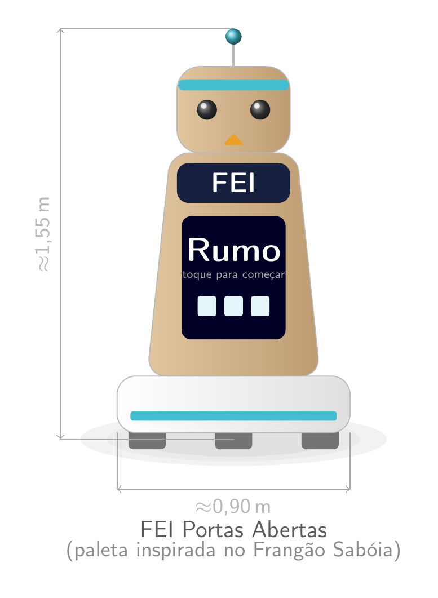
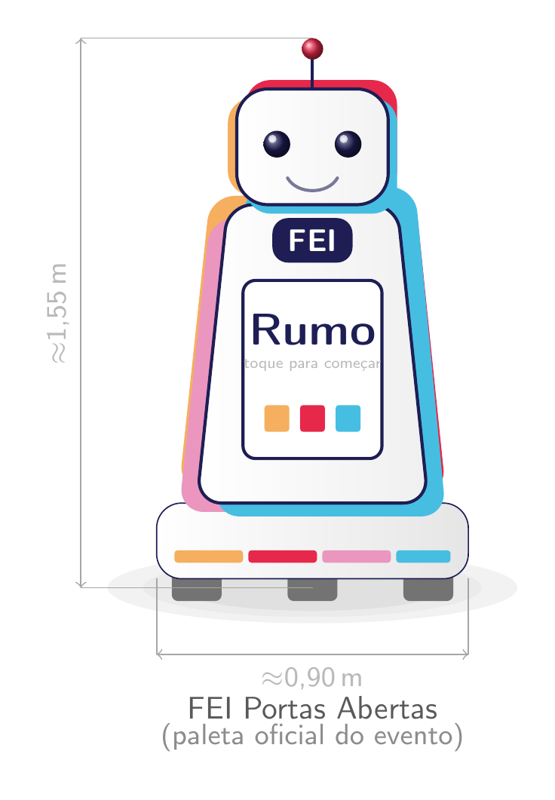

> [!IMPORTANT]
> Cada seção tem dois tipos de bloco de apoio, que **devem ser apagados** antes da entrega final — o README entregue deve conter só o texto do grupo:
> - **💡 (Dica)** — o que escrever nessa seção, com base nas aulas de IHR.
> - **📄 (Exemplo)** — um exemplo preenchido, de um robô fictício ("Rumo", robô guia da FEI para o FEI Portas Abertas), só para ilustrar o **nível de detalhe e o formato** esperados.

# **<Nome do Robô>:** <Aplicação do robô>

Trabalho de Interação Humano-Robô (IHR) apresentado ao Centro Universitário [FEI](https://portal.fei.edu.br/), como parte dos requisitos necessários para aprovação na disciplina de Interação Humano-Robô (IHR) (CCR230) do curso de Engenharia de Robôs, orientado pelo Prof. Dr. [Fagner de Assis Moura Pimentel](https://github.com/fagnerpimentel).

## Componentes do Grupo

> 💡 Adicione os nomes e RAs dos integrantes
> - Nome - RA
> - Nome - RA
> - Nome - RA

## Resumo

> 💡
> Apresente uma breve descrição do seu robô e sua aplicação (tarefa que ele irá resolver).

📄

O Rumo é um robô recepcionista para o FEI Portas Abertas. Ele acolhe os visitantes no saguão de entrada, apresenta rapidamente os cursos oferecidos e guia grupos até o laboratório de interesse, reduzindo a fila de espera por monitores humanos nos horários de pico.

## Introdução

> 💡
> - Apresente uma contextualização para o problema que o seu robô irá resolver e por quê esse tipo de robô é necessário hoje na sociedade.
> - Apresente uma breve descrição do seu robô e sua aplicação (tarefa que ele irá resolver).
> - Em uma única frase, resuma o objetivo do seu robô.
> - Que tipo de experiência o robô deve proporcionar para os usuários?

📄

Todo ano a FEI recebe centenas de visitantes no FEI Portas Abertas, mas há poucos monitores voluntários disponíveis nos horários de pico — visitantes ficam perdidos no saguão ou esperando muito tempo por orientação. O Rumo é um robô móvel com tela e um braço apontador que recebe visitantes na portaria, apresenta um menu de destinos (curso, laboratório, auditório) e os guia até lá, verificando se o grupo continua acompanhando.

**Objetivo em uma frase:** ajudar visitantes do FEI Portas Abertas a encontrar, sem depender de um monitor humano, o curso e o laboratório que querem conhecer.

**Experiência desejada:** acolhedora, confiável e levemente lúdica — sem intimidar quem nunca interagiu com um robô antes.

## Público-Alvo e Stakeholders

> 💡
> Determine o seu público alvo.

### Stakeholders

> 💡
> Identifique os **stakeholders** do projeto — todos os envolvidos e afetados pelo robô, mesmo sem interagir diretamente com ele:
> - **Primários** — usam o robô diretamente.
> - **Secundários** — têm contato intermitente com o robô ou interagem com ele por meio de um intermediário.
> - **Terciários** — são afetados pelo robô (positiva ou negativamente) sem necessariamente interagir com ele.

📄

- **Primários** — visitantes (futuros alunos e famílias) que pedem informações e são guiados pelo robô.
- **Secundários** — recepcionistas e seguranças da portaria, que cruzam com o robô no saguão e ocasionalmente o auxiliam.
- **Terciários** — coordenadores de curso, cujo número de inscrições pode ser afetado pela impressão (boa ou ruim) que o robô causa nos visitantes.

### Personas

> 💡
> - Descreva as personas que irão interagir com o robô. Deixe claro suas principais características e contextos sociais, econômicos e culturais.
> - Quais informações sobre o usuário o robô deve saber antes de iniciar a tarefa?

- Persona primária ...
- Persona secundária ...
- Outras personas ...

📄

- **Persona primária — Ana, 17 anos:** aluna do 3º ano do ensino médio, indecisa entre Engenharia de Robôs e Ciência da Computação, visita a FEI pela primeira vez acompanhada da mãe. Não sabe onde fica nenhum laboratório.
- **Persona secundária — Sr. Carlos, 50 anos:** pai de Ana, mais cético em relação a tecnologia, preocupado com o custo do curso e a empregabilidade; tende a fazer perguntas objetivas e desconfia de recomendações "automáticas".

### Mapa de empatia

> 💡
> Determine o mapa de empatia[^1] de pelo menos uma persona primária e uma secundária.
> - O que o usuário vê: aqui estamos falando do ambiente visual em que o usuário se encontra. Ou seja, o que ele efetivamente enxerga, as pessoas e objetos que estão ao seu redor. Isso ajuda a entender o contexto em que o usuário está inserido e as influências visuais que está recebendo.
> - O que o usuário ouve: neste quadrante, buscamos entender o que o usuário está ouvindo, os sons que o cercam e como eles influenciam suas ações.
> - O que o usuário diz e faz: aqui consideramos ações e comportamentos que o usuário apresenta durante sua interação com o robô.
> - O que o usuário pensa e sente: neste quadrante, buscamos entender os pensamentos, sentimentos, emoções e percepções que o usuário tem em relação robô. Quais expectativas o usuário cria sobre o robô? Que tipo de robô mais agrada essa persona?
> - Dores: quando falamos sobre dores do usuário, estamos fazendo referência a quaisquer obstáculos, necessidades ou frustrações que o usuário possa experimentar ao tentar realizar uma tarefa ou alcançar um objetivo. Isso inclui, por exemplo, problemas de usabilidade, dificuldades de acesso ou outros desafios que podem afetar a experiência do usuário.
> - Ganhos: nesse caso estamos falando de quaisquer benefícios ou recompensas que o usuário possa experimentar ao utilizar o robô. Isso pode incluir economia de tempo ou facilidade de uso, por exemplo. Que desejos do usuário o robô satisfaz?

📄 (persona: Ana)

- **Vê:** banners coloridos, estudantes de jaleco, placas de curso, o robô Rumo se movendo pelo saguão.
- **Ouve:** música ambiente do evento, outros visitantes conversando, um monitor anunciando horários de palestras.
- **Diz e faz:** pergunta "onde fica o laboratório de robótica?", tira foto do robô, segue meio hesitante quando ele começa a andar.
- **Pensa e sente:** ansiosa por decidir a faculdade certa, curiosa e um pouco encantada com o robô, insegura se vai dar conta do curso.
- **Dores:** medo de escolher a faculdade errada; vergonha de fazer perguntas "óbvias" para um humano.
- **Ganhos:** sente-se acolhida sem julgamento ao perguntar ao robô; economiza tempo achando o laboratório sozinha.

## Contexto de uso

> 💡
> - Descreva o ambiente em que o robô interage com os usuários
> - Qual/quais o(s) contexto(s) sociais, econômicos e culturais existentes neste ambiente?
> - Quais informações sobre o ambiente o robô deve saber antes de iniciar a tarefa?

📄

Saguão de entrada e corredores do prédio principal da FEI, durante o FEI Portas Abertas (evento de um único dia, com alta lotação). O ambiente é barulhento e há vários grupos de visitantes circulando ao mesmo tempo, muitos acompanhados de monitores humanos. O robô precisa saber, antes de começar, o mapa dos laboratórios abertos naquele dia e quais estão temporariamente fechados.

## Jornada do usuário

> 💡
> - Criar uma narrativa para o o seu robô e o usuário.
> - Determine o passo a passo que o usuário realiza desde o primeiro até o último encontro com robô na realização da tarefa.
> - O que está acontecendo com o ambiente quando o robô está interagindo com o usuário?
>   - Descreva o que acontece ou pode acontecer passo a passo
>   - Como a tarefa começa? Como a tarefa evolui? Como a tarefa termina?
> - Enfatize todos os momentos em que acontece uma interação verbal, não-verbal e espacial.

📄

1. Ana e o pai entram no saguão e ficam parados olhando ao redor, sem saber para onde ir.
2. O Rumo percebe o grupo parado (sinal de "perdido") e se aproxima devagar, pela frente, mantendo distância social *(espacial)*.
3. O robô pergunta "Posso ajudar vocês a encontrar algum curso ou laboratório?" e mostra um menu de ícones na tela *(verbal)*.
4. Ana toca em "Engenharia de Robôs"; o robô confirma e começa a andar, olhando de tempos em tempos para trás para checar se o grupo o segue *(espacial + não-verbal)*.
5. No corredor, o robô encontra duas pessoas conversando e contorna sem passar entre elas *(espacial)*.
6. Ao chegar no laboratório, o robô se vira de frente para o grupo, inclina levemente a "cabeça" e deseja uma boa visita *(não-verbal)*.

## Análise de concorrência

> 💡
> - Pesquise robôs existentes atualmente que possam fazer a tarefa deste projeto.
> - Selecione pelo menos 3 robôs diferentes que podem fazer essa tarefa.
> - Em relação aos concorrentes, respondam as seguintes perguntas:
>   - Existe plataforma similar que atende o mesmo mercado e funcionalidades? Se sim: Quais os pontos positivos? Quais os pontos negativos?
>   - Existe plataforma diferente quanto ao serviço, mas que atenda esse mercado? Se sim: Quais os pontos positivos? Quais os pontos negativos?
>   - Quais plataformas sua equipe acha mais interessantes? Qual a justificativa?

📄

- **Totens interativos de informação** (comuns em aeroportos e shoppings) — bons para consultar informação estática, mas não guiam fisicamente o visitante até o destino.
- **Aplicativo de mapa indoor do campus** — dispensa hardware físico, mas perde o acolhimento social que um robô oferece a um visitante inseguro.
- **Pepper (SoftBank Robotics)**, usado em recepções comerciais — proposta muito parecida (recepcionar e guiar), mas é caro e não é sob medida para o layout da FEI.

A equipe considera o Pepper a referência mais próxima, mas acredita que um robô mais simples e barato (sem braços articulados) atende igualmente bem ao caso de uso do FEI Portas Abertas.

## Design do Robô

### Forma, função e affordances

> 💡
> - Pense nas características de affordances do seu robô. Que tipo de acessibilidades devem ser consideradas dentro do seu projeto?
> - A aparência e o comportamento do robô **casam com a função**? Que affordances a forma sinaliza (olhos → enxergar, braços → pegar objetos, tela → interagir por toque)?
> - Discuta o papel das expectativas do usuário no projeto de um robô. Onde faz sentido "**prometer menos e entregar mais**" (underpromise, overdeliver)?

📄

O Rumo tem uma tela no "peito" (affordance de toque), uma "cabeça" com dois pontos luminosos (olhos) que sinalizam para onde está olhando, e **não** tem braços — o que sinaliza corretamente que ele não manipula objetos, apenas informa e guia. Para "prometer menos, entregar mais", o robô nunca é chamado de "assistente inteligente" nos materiais do evento, apenas de "guia do FEI Portas Abertas", evitando a expectativa de uma conversa livre e aberta.

### Grau de antropomorfismo

> 💡
> - O seu robô tem um padrão com mais ou menos características antropomórficas (androide, humanoide, zoomórfico, minimalista, robject)? Marquem um ponto no espectro máquina ↔ humano e justifiquem.
> - Qual padrão é mais aceito pela sociedade dentro do projeto que você está desenvolvendo?
> - Como o grupo pretende evitar o **vale da estranheza** (uncanny valley), caso o robô tenha um design muito próximo do humano?

📄

O Rumo fica próximo do polo **minimalista** do espectro, com leve antropomorfismo (olhos, "cabeça" que gira), sem rosto detalhado nem fala emocional complexa — parecido com o Keepon citado na aula de Design. Justificativa: um design fortemente humano geraria expectativa de conversa fluida, que o robô não tem; pouco antropomorfismo, por outro lado, dificultaria que visitantes se sintam à vontade para abordá-lo. Por ficar longe do polo humano, o risco de vale da estranheza é baixo.

### Padrões de design

> 💡
> Identifique **2 padrões de design** (design patterns) aplicáveis ao seu projeto e explique como eles se **combinam**.

📄

**"Apresentação inicial"** (o robô se apresenta brevemente antes de perguntar o destino) + **"em movimento junto"** (anda ao lado/à frente do grupo, ajustando o ritmo ao visitante mais lento) — combinados, formam o padrão composto de "robô guia turístico".

### Valores e ética

> 💡
> - Aplicando o **Value-Sensitive Design (VSD)** — a tecnologia deve se adaptar às necessidades humanas, não o contrário — identifique **1 a 2 valores** em jogo no seu projeto (privacidade, autonomia, segurança, inclusão, etc.).
> - Identifique **1 risco ético** do seu robô e como o grupo pretende mitigá-lo.

📄

**Valores:** acessibilidade (o robô deve ajustar a velocidade para visitantes com mobilidade reduzida) e privacidade (não deve gravar ou reconhecer rostos sem consentimento).

**Risco ético:** o robô poderia, sem querer, direcionar mais visitantes para cursos "badalados", reduzindo a visibilidade de cursos menos procurados. **Mitigação:** o menu de destinos sempre mostra todos os cursos na mesma ordem e tamanho, sem personalização por popularidade.

### Protótipo no papel

> 💡
> Modele o seu robô com desenhos de formas primitivas (caixas, cilindros, esferas): forma, tamanho, rosto/olhos, partes móveis, tela. É o protótipo mais barato e rápido — lembre-se do lema "**teste cedo, teste sempre**".
>

📄

 Corpo afunilado sobre uma base omnidirecional (três rodas onidirecionais, em arranjo triangular); "cabeça" arredondada com dois olhos, uma antena/sensor no topo; tela na parte de cima do torso, com o nome do robô; sem braços — apenas um anel de luz na base para sinalizar status. Altura total ≈1,55 m; diâmetro da base ≈0,90 m.

## Ações do robô

> 💡
> Para cada ação:
> - Descreva a ação.
> - Determine os pré-requisitos para que a ação aconteça
> - Determine o que se espera que seja modificado no ambiente quando a ação é finalizada

📄

**Guiar até o destino** — pré-requisito: destino escolhido no menu e caminho livre conhecido no mapa do dia. Ao finalizar: o visitante está fisicamente no laboratório e o robô retorna à posição de espera no saguão.

**Dar informação rápida** — pré-requisito: pergunta reconhecida dentro do conjunto de perguntas frequentes cadastradas. Ao finalizar: a resposta foi falada e também exibida na tela.

## Interações do robô

### Espacial

> 💡
> - Descreva **onde** o robô se posiciona em relação ao usuário (distância e orientação do corpo), usando as **zonas de proxêmica** (Hall) e as **F-formations**.
> - Como o robô **inicia** a interação (direção de aproximação) e como **sinaliza** para onde vai?
> - Para cada interação espacial:
>   - Descreva a interação.
>   - Determine os pré-requisitos para que a interação aconteça.
>   - Determine a resposta emocional esperada do usuário quando a interação é finalizada.
> - O que o robô faz ao encontrar pessoas **paradas, em conversa ou em grupo**, e ao passar por elas num corredor (sem cruzar entre pessoas conversando)?
> - Proponha **um ajuste** desse comportamento espacial para um contexto de uso diferente do principal.

📄

- **Posicionamento:** aborda o grupo a uma distância social (2–3 m), sempre pela frente, nunca por trás.
- **Início da aproximação:** aproxima-se em diagonal (nunca em linha reta "contra" a pessoa), reduzindo a velocidade a 1,5 m de distância.
- **Sinalização de destino:** gira a "cabeça" na direção do laboratório antes de começar a andar.
- **Grupos e corredores:** ao encontrar duas pessoas conversando, contorna por trás delas, sem passar entre as duas; para grupos maiores, aguarda uma abertura natural na formação.
- **Ajuste de contexto:** em dias normais de aula (sem evento), o robô aumenta a distância de abordagem, já que há menos ruído social e mais espaço livre no saguão.

### Verbal

> 💡
> - A interação verbal do robô será **restrita** (comandos, FSM) ou **aberta** (LLM/chatbot)? Justifique a escolha.
> - Para cada interação verbal:
>   - Descreva a interação.
>   - Determine os pré-requisitos para que a interação aconteça.
>   - Determine a resposta emocional esperada do usuário quando a interação é finalizada.
> - Como o robô lida com o **timing** das respostas (silêncio, marcadores conversacionais como "uh-huh")?
> - Que tipo de voz (TTS) o robô usa, e por que ela **combina** com a aparência e o propósito dele?
> - Identifique **uma limitação** do reconhecimento de fala (ruído, sotaque, vocabulário) que afetaria o seu cenário de uso, e como mitigá-la.

📄

**Restrita** — usa uma árvore de diálogo (FSM) com um conjunto fechado de destinos e perguntas frequentes, pois o saguão é ruidoso e o vocabulário esperado é previsível; mais confiável do que abrir para um LLM.

**Timing:** ao processar um pedido, o robô emite um "hum" sonoro curto e pisca os olhos em sequência, evitando silêncio constrangedor.

**Voz:** TTS de tom jovem e neutro, volume ajustável ao ruído do saguão — combina com o porte pequeno do robô (uma voz grave soaria estranha).

**Limitação do ASR:** o ruído do evento atrapalha o reconhecimento de nomes de professores e disciplinas. **Mitigação:** escolhas críticas (curso, laboratório) são feitas por toque na tela; o reconhecimento de fala só é usado para perguntas simples de sim/não.

### Não-verbal

> 💡
> - Escolha **dois canais** não verbais (olhar, gesto, toque, postura, ritmo, imitação) e descreva como o robô os usaria.
> - Para cada interação não-verbal:
>   - Descreva a interação.
>   - Determine os pré-requisitos para que a interação aconteça.
>   - Determine a resposta emocional esperada do usuário quando a interação é finalizada.
> - Explique como o robô **perceberia** as pistas não verbais correspondentes da pessoa.
> - Descreva um caso em que a **falta de coordenação** entre fala e comportamento não verbal quebraria a interação.
> - Proponha **uma pista não verbal exclusiva** do robô (sem equivalente humano direto) que ajudaria na comunicação.

📄

**Canais escolhidos: olhar e postura.**
- **Olhar:** os "olhos" de LED giram na direção de quem está falando com o robô e na direção da rota a seguir.
- **Postura:** o corpo se inclina levemente para frente ao iniciar a aproximação (convite) e se afasta/gira de lado ao encerrar a interação (despedida).

**Percepção:** uma câmera de profundidade detecta se a pessoa está olhando para o robô (atenção) e se está parada olhando ao redor (sinal de estar perdida).

**Falta de coordenação:** se o robô disser "vamos ao laboratório de robótica" mas girar para o lado errado, o grupo hesita e para de segui-lo — a confiança se quebra.

**Pista exclusiva do robô:** um anel de luz na base pisca em verde quando o robô está confiante do caminho e em amarelo quando está recalculando a rota — sem equivalente humano direto, mas comunica incerteza de forma clara.

## Emoção

> 💡
> - Escolha um **modelo de emoção** (categorias básicas de Ekman, modelo OCC ou modelo dimensional — Russell ou PAD) e justifique a escolha para o seu caso de uso.
> - Descreva **como** o robô perceberia o estado emocional do usuário, e por quais canais (rosto, voz, postura, outro).
> - Defina **quando** o robô deve mimetizar a emoção da pessoa e **quando não deve** (lembre-se da exceção da raiva — retribuir raiva raramente ajuda a resolver o conflito).
> - Identifique um risco de **gerenciamento de expectativas**: se o robô parece emocionalmente responsivo, que outras capacidades sociais o usuário passa a esperar dele? O robô consegue cumprir essa expectativa?

📄

**Modelo:** categorias básicas de Ekman (feliz, surpreso, neutro) — simples o suficiente para expressar por luzes e tom de voz, sem exigir um rosto detalhado.

**Percepção:** o robô reconhece tom de voz alterado (frustração) pelo microfone e expressões faciais básicas pela câmera, para saber se o visitante está confuso ou satisfeito.

**Mimetismo:** mimetiza entusiasmo — se o visitante se anima ao ver o laboratório de robótica, o robô "sorri" com as luzes — mas **nunca** mimetiza a impaciência de um visitante apressado; nesse caso mantém tom calmo e oferece um caminho mais curto.

**Risco de expectativa:** se o robô demonstra "empolgação", visitantes podem esperar que ele converse sobre assuntos abertos (ex.: "e as notas de corte?"). O robô precisa deixar claro, de forma simpática, quando um assunto está fora do seu escopo.

---                                                                                                                                                                                                                                                                                                                                                                                                                                                                                                                                                                                                                                                                                                                                     
[^1]: Fonte: Adaptado de <https://hazeshift.com.br/mapa-de-empatia/>
